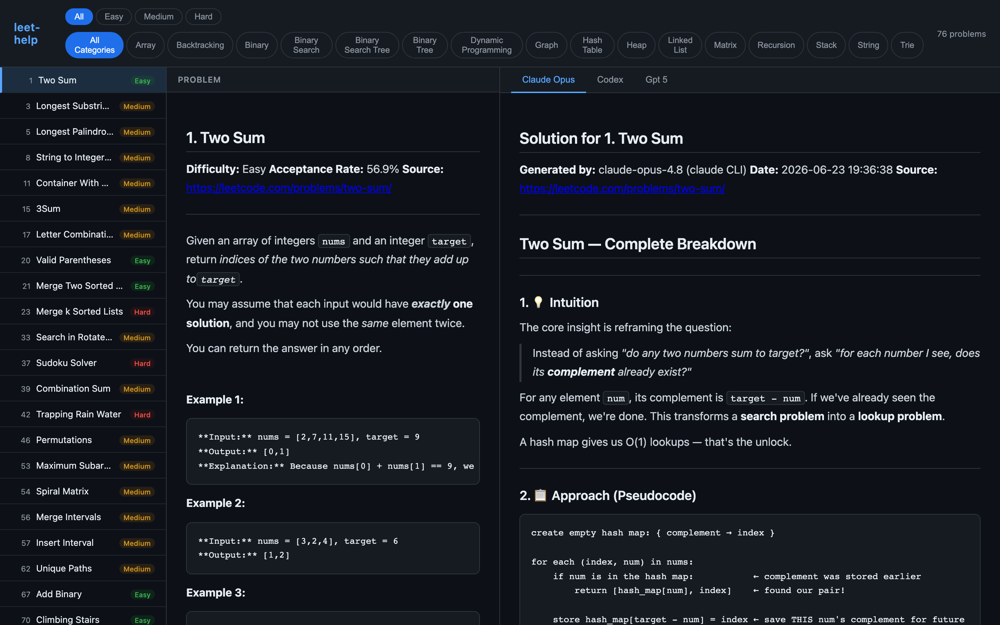

# leet-help

A LeetCode study workbook builder. Download problems, generate AI-authored solutions, browse them in a split-pane web UI, and export PDF workbooks.



**The primary way to use this project is through its skills.** Inside Claude Code (or Codex) in this repo, you drive everything with three slash commands — no need to memorize CLI flags.

## Skills

| Skill | What it does |
|---|---|
| **`/download-leetcode-problem {n}`** | Fetches a problem's metadata from LeetCode, infers its category, updates `problem-index.csv`, and downloads the statement to `problems/{n}-{slug}/problem.md`. |
| **`/solve-leetcode-problem {n}`** | Generates a verified solution (intuition → pseudocode → commented Python → complexity analysis) and writes it to the problem's directory. |
| **`/generate-leethelp-pdf {n}`** | Builds the per-problem `solutions.pdf` and rebuilds the combined `all-solutions.pdf` workbook. |

A typical flow for a new problem:

```
/download-leetcode-problem 37     # fetch + index problem 37
/solve-leetcode-problem 37        # write the solution
/generate-leethelp-pdf 37         # export the PDF
```

Each skill accepts one or more problem numbers (e.g. `/solve-leetcode-problem 1 3 21`). The solve and PDF skills also work with no argument to process every problem in the index.

### ⚠️ Change the model before regenerating solutions

`/solve-leetcode-problem` uses **whatever model your current session is running** — it *is* the solver. Before regenerating, switch to the strongest available model so you get the best solution:

1. Run `/model` and select **Opus 4.8** (the strongest Claude model).
2. Then run `/solve-leetcode-problem {n}`.

The generated file records the exact model in its header (`**Generated by:** claude-opus-4-8`), so you can always see which model produced a given solution. If you run the skill on a weaker model, the solution — and the recorded model name — will reflect that. Codex sessions use `gpt-5` and write to `solution-codex.md`.

### Agent instructions

`AGENTS.md` (symlinked to `CLAUDE.md`) tells any agent — Claude Code or Codex — which skill to use for each request. The skills themselves are plain markdown in `.claude/skills/`, so they work in any agent that can read and follow them.

## Installation

### Prerequisites

- Python 3.11+
- [uv](https://github.com/astral-sh/uv) package manager
- Homebrew (macOS) for PDF dependencies

```bash
git clone https://github.com/hafiz-ahsan/leet-help.git
cd leet-help

uv sync                              # install dependencies
uv run playwright install chromium   # browser for downloading
brew install pango                   # PDF dependencies (macOS)
```

## Web UI

Browse problems and solutions side by side:

```bash
DYLD_FALLBACK_LIBRARY_PATH=/opt/homebrew/lib uv run leet-help serve
```

Opens `http://127.0.0.1:8000`:

- **Left column** — filterable problem list (by difficulty and category)
- **Middle pane** — problem statement (always visible)
- **Right pane** — solution tabs (Claude, Codex, GPT-5), defaulting to the Claude solution

## CLI (used by the skills)

The skills wrap these commands. You can run them directly if you prefer. `problem-index.csv` is the default for all of them — no `--csv` needed.

```bash
# Download specific problems (skips already-downloaded ones)
uv run leet-help download -p 1 -p 3

# Generate PDFs (combined workbook written to all-solutions.pdf)
DYLD_FALLBACK_LIBRARY_PATH=/opt/homebrew/lib uv run leet-help pdf -p 1 -p 3

# Generate a markdown index
uv run leet-help index

# Start the web UI
DYLD_FALLBACK_LIBRARY_PATH=/opt/homebrew/lib uv run leet-help serve
```

On macOS, prefix `pdf` and `serve` with `DYLD_FALLBACK_LIBRARY_PATH=/opt/homebrew/lib`.

Note: solution generation is **not** a CLI command — it lives entirely in the `/solve-leetcode-problem` skill, because the agent itself is the solver (no API keys, no external LLM calls).

## Solution file format

Every solution file begins with a standard header:

```markdown
# Solution for {Number}. {Title}

**Generated by:** {model name}
**Date:** {YYYY-MM-DD HH:MM:SS}
**Source:** <{URL}>

---
```

## Project Structure

```
leet-help/
├── AGENTS.md / CLAUDE.md            # Agent instructions (which skill for which task)
├── problem-index.csv                # Problem list (grows as problems are added)
├── all-solutions.pdf                # Combined PDF workbook
├── .claude/skills/
│   ├── download-leetcode-problem/   # /download-leetcode-problem
│   ├── solve-leetcode-problem/      # /solve-leetcode-problem
│   └── generate-leethelp-pdf/       # /generate-leethelp-pdf
├── src/leet_help/
│   ├── cli.py                       # CLI entry point (download, index, pdf, serve)
│   ├── downloader.py                # Problem downloader (Playwright)
│   ├── server.py                    # FastAPI web server
│   ├── indexer.py                   # Markdown index generator
│   ├── pdf_generator.py             # PDF generator (WeasyPrint)
│   ├── models.py                    # Data models
│   └── utils.py                     # Shared utilities
├── templates/
│   ├── browser.html                 # Web UI (marked.js + highlight.js)
│   └── problem.html                 # PDF template
└── problems/                        # Downloaded problems & solutions
    └── 1-two-sum/
        ├── problem.md
        ├── solution-claude-opus.md
        ├── solution-codex.md
        ├── solution-gpt-5.md
        └── solutions.pdf
```

## Dependencies

- **click** — CLI framework
- **playwright** — browser automation for downloading problems
- **html2text** — HTML to Markdown conversion
- **weasyprint** — HTML to PDF conversion
- **jinja2** — HTML templating
- **markdown** — Markdown to HTML conversion
- **pygments** — syntax highlighting (PDF)
- **pypdf** — PDF concatenation
- **fastapi** + **uvicorn** — web server for the browser UI

## License

MIT
